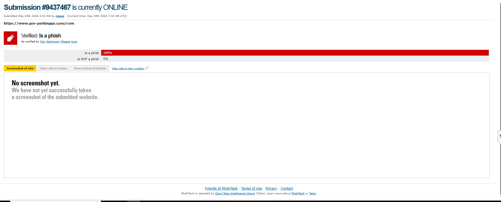
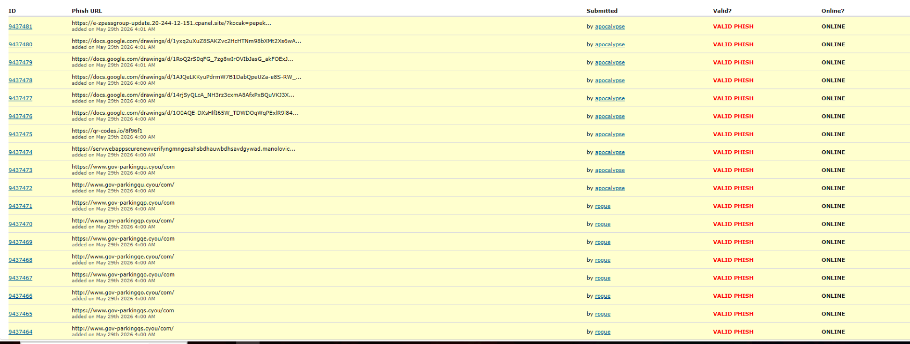
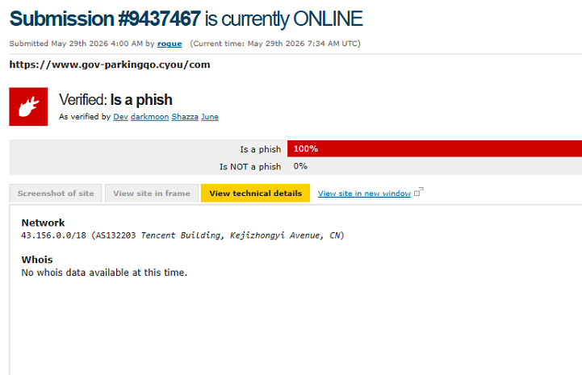
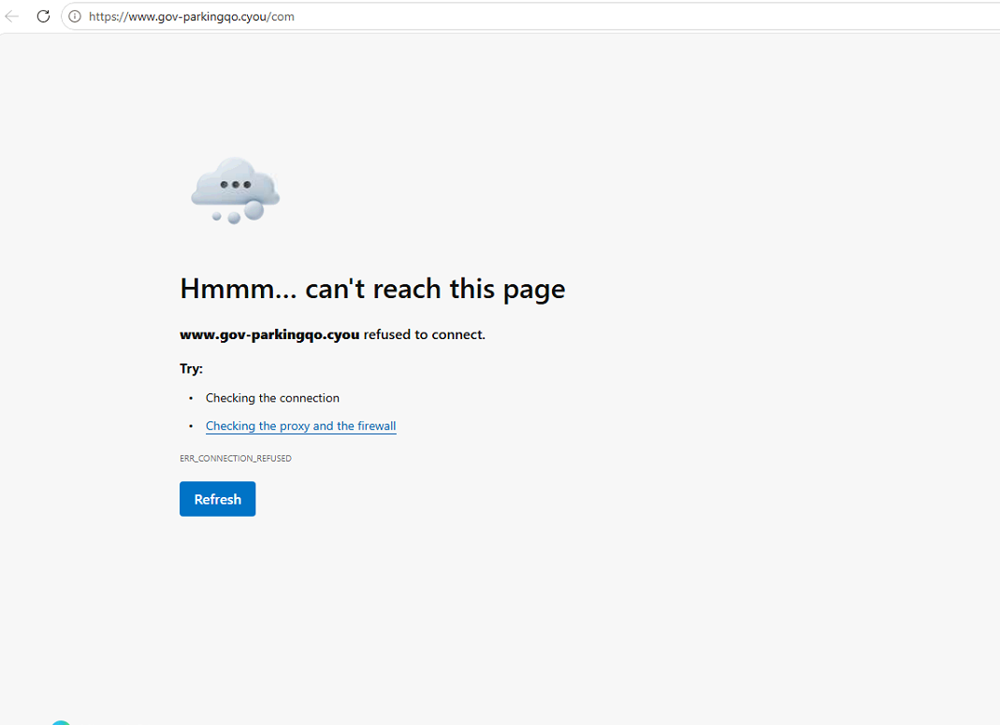

# phishing-email-analysis-lab
Phishing email analysis lab focused on header analysis, IOC extraction, threat intelligence enrichment, and incident response reporting.

# Phishing Email Investigation Report

# Phishing Email Analysis Lab

## Project Overview

This project demonstrates the investigation of a phishing campaign using publicly available threat intelligence from PhishTank.

The objective was to identify malicious infrastructure, extract indicators of compromise (IOCs), assess risk, and document incident response actions.

## Skills Demonstrated

- Phishing Analysis
- Threat Intelligence
- IOC Extraction
- Domain Reputation Analysis
- Incident Response
- Security Documentation
- SOC Investigation Methodology

## Investigation Workflow

1. Identify phishing URL from PhishTank
2. Verify malicious classification
3. Review technical details
4. Extract IOCs
5. Assess infrastructure
6. Document containment actions
7. Produce incident report

## Evidence

### Phishing URL Discovery

### Threat Intelligence Verification

### Technical Details

### Site Unreachable

## Investigation Report

See:

reports/phishing-investigation-report.md

## Author

Matt Stokes

Aspiring SOC Analyst / Cybersecurity Professional
