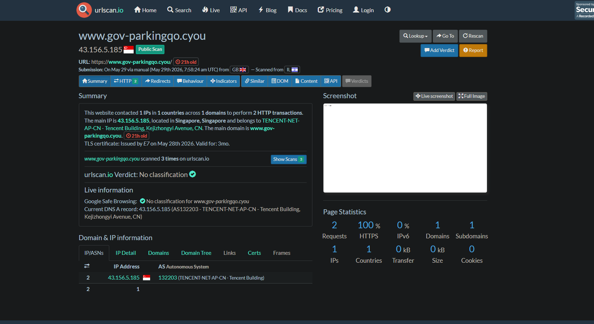
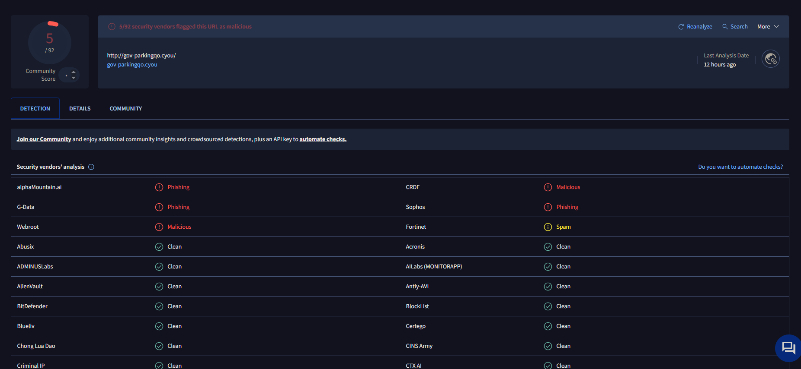

# phishing-email-analysis-lab
Phishing email analysis lab focused on header analysis, IOC extraction, threat intelligence enrichment, and incident response reporting.

## Project Overview

This project demonstrates the investigation of a phishing campaign using publicly available threat intelligence from PhishTank.

The objective was to identify malicious infrastructure, extract indicators of compromise (IOCs), assess risk, and document incident response actions.

## Skills Demonstrated

- Phishing Analysis
- Threat Intelligence
- IOC Extraction
- Domain Reputation Analysis
- Incident Response
- Security Documentation
- SOC Investigation Methodology

## Investigation Workflow

1. Identify phishing URL from PhishTank
2. Verify malicious classification
3. Review technical details
4. Extract IOCs
5. Assess infrastructure
6. Document containment actions
7. Produce incident report

## Investigation Evidence

### PhishTank Threat Intelligence Feed

### PhishTank Verification

### Technical Details

### URLScan Threat Intelligence

### VirusTotal Analysis

### Site Availability Check

## Investigation Report

[Phishing Investigation Report](reports/phishing-investigation-report.md)

## Key Findings

- Confirmed phishing domain using PhishTank intelligence.
- Domain hosted on Tencent Cloud infrastructure.
- URLScan identified the associated IP address as 43.156.5.185.
- VirusTotal reported multiple security vendors classifying the domain as phishing or malicious.
- Domain naming convention attempted to impersonate a government parking service.
- Site became unavailable shortly after analysis, indicating potential takedown or infrastructure removal.

  
## Author

Matt Stokes

Aspiring SOC Analyst | IT Support Technician | Cybersecurity Enthusiast

GitHub: https://github.com/MS241290

